# Top 15 AI Video Generators Ranked in 2025 (Latest Compilation)

Creating videos used to mean hauling around cameras, booking studios, wrestling with complex editing software. These days? You just type what you want, maybe upload a photo, and boom—professional content appears on your screen within minutes. AI video generators are shifting the entire game for marketers, educators, and anyone who needs visual content without burning through budgets or weekends.

The platforms below represent the strongest options available right now for transforming scripts, ideas, or images into finished videos. Each brings different strengths, whether that's hyper-realistic avatars, multilingual dubbing, or the ability to turn a blog post into social-ready clips. What matters is finding the one that fits how you actually work.

## **[VideoGen](https://videogen.io)**

Purpose-built platform that handles everything from outlining to final polish within minutes.

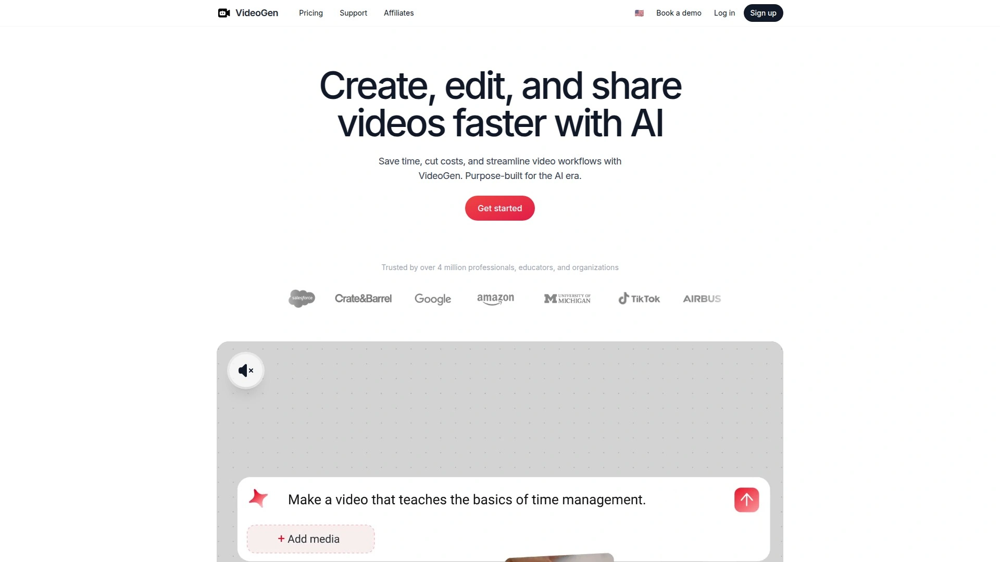

VideoGen streamlines the entire video workflow by deploying AI agents that handle media sourcing, script outlining, and final touches automatically. The system supports over 200 unique voices across 50+ languages with one-click translation, making global content distribution straightforward. Teams can collaborate within browser-based workspaces using project sharing and centralized billing, eliminating software installation headaches.

The platform generates professional voiceovers and AI avatars instantly, removing recording friction entirely. With 4+ million users across professional and educational settings, VideoGen proves particularly valuable for scenarios demanding rapid turnaround without sacrificing production quality. The three-click workflow from concept to finished video drastically compresses timelines compared to traditional production methods.

## **[Synthesia](https://www.synthesia.io)**

Enterprise-grade solution offering 230+ avatars in 140+ languages for scalable business content.

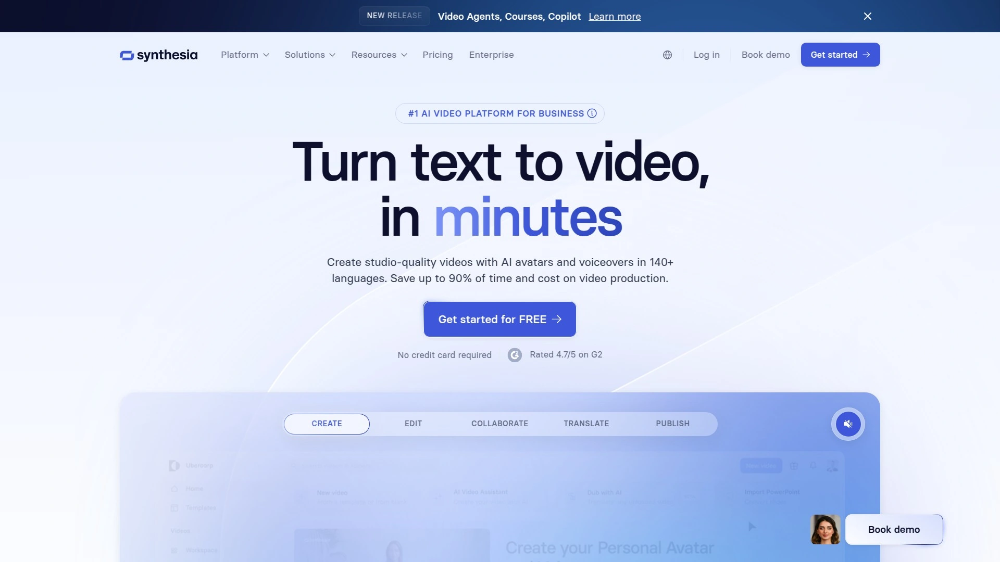

Synthesia delivers studio-quality videos through AI avatars that speak flawlessly in 140+ languages, with automatic lip-sync translation built in. Users can create custom avatars from simple recordings, maintaining consistent brand presence across all content. The platform automatically converts documents, links, or raw ideas into polished videos matching brand guidelines, while real-time collaboration tools keep teams aligned during production.

The one-click update system ensures no broken links or version sprawl—every revision syncs automatically to the original video. SCORM export functionality enables direct integration with learning management systems, and built-in analytics track views, drop-offs, and completion rates. Synthesia particularly excels in corporate training and multilingual business communications where consistency and scalability matter most.

## **[Runway](https://runwayml.com)**

Advanced creative platform combining text-to-video, image-to-video, and sophisticated camera controls.

Runway stands out for creators needing cinematic quality and precise visual control. The platform offers text-to-video and image-to-video generation with advanced camera motion settings—pans, tilts, zooms, and rolls adjust dynamically during creation. The Motion Brush feature assigns specific movement patterns to selected areas, while Act One enables character animation through uploaded static images or recorded performances.

Gen-3 Alpha Turbo and Gen-2 models provide flexibility between speed and quality, with outputs reaching 2K resolution. The Expand Video feature converts vertical footage to horizontal (or vice versa) while maintaining frame integrity. Runway's strength lies in visual storytelling projects where creative control and professional polish outweigh the need for avatars or narration.

## **[HeyGen](https://www.heygen.com)**

Interactive avatar specialist creating personalized video experiences at scale.

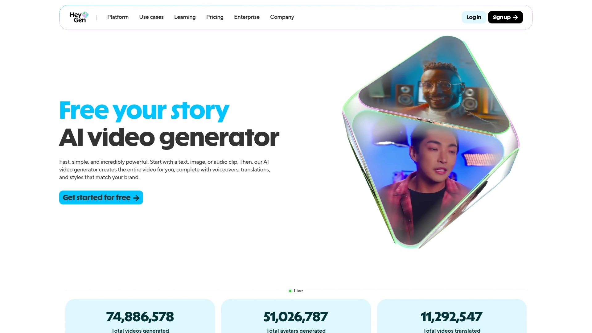

HeyGen transforms static content into dynamic experiences through real-time interactive AI avatars. The platform enables voice-to-video conversion where uploaded audio automatically generates synchronized lip movements and facial expressions. Users can create custom avatars matching their own likeness, then deploy them across marketing funnels, onboarding sequences, or customer support channels.

The system supports multilingual voiceovers and instant video translation, expanding reach without multiplying production costs. HeyGen integrates via API for workflow automation, triggering avatar video creation from CRM updates or form submissions. Pricing starts at $29/month for creators, with team and enterprise tiers available. The platform excels when personalization and interactivity drive engagement goals.

## **[InVideo AI](https://invideo.io/make/ai-video-generator/)**

Prompt-driven generator turning simple text commands into publish-ready videos.

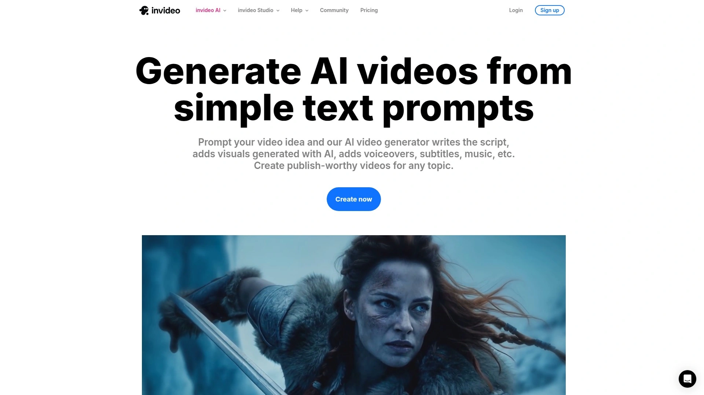

InVideo AI produces complete videos from text prompts by generating scripts, selecting AI visuals, adding voiceovers, subtitles, and background music automatically. Users specify length, platform, and voiceover accent, then edit results through natural language commands in the Magic Box—requests like "change the accent" or "delete this scene" instantly modify outputs.

The platform now integrates Google's Veo 3.1 model for enhanced text-to-video capabilities, covering promos, social content, and explainer formats. With 50+ language support and realistic AI voices that capture emotional nuance, InVideo handles global content needs efficiently. The tool suits creators prioritizing speed and volume over granular creative control, particularly for social media and digital marketing campaigns.

## **[Pictory AI](https://pictory.ai)**

Article-to-video converter with extensive stock media libraries and voice synthesis.

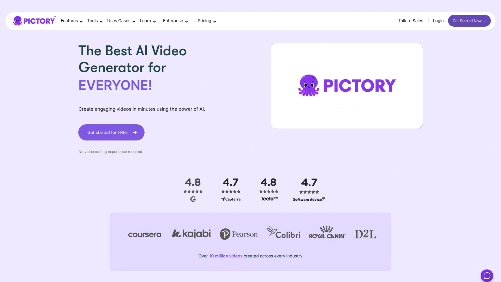

Pictory AI specializes in transforming text articles, scripts, or blog posts into narrated videos automatically. The platform transcribes content, creates scenes, and pulls from over 12 million royalty-free assets via Getty Images and Storyblocks partnerships. ElevenLabs integration delivers high-quality AI voiceovers with varied cadences and emotional tones.

Users can edit scenes individually, swap stock footage, adjust timing, and customize branding elements. The text-based editing interface allows trimming by simply deleting words from transcripts. Pictory handles both short social clips and longer content pieces, with the free trial supporting three videos up to 5 minutes each. The tool works best for content marketers converting written material into visual formats quickly.

## **[Descript](https://www.descript.com)**

Text-based video editor combining transcription, AI cleanup, and multitrack production.

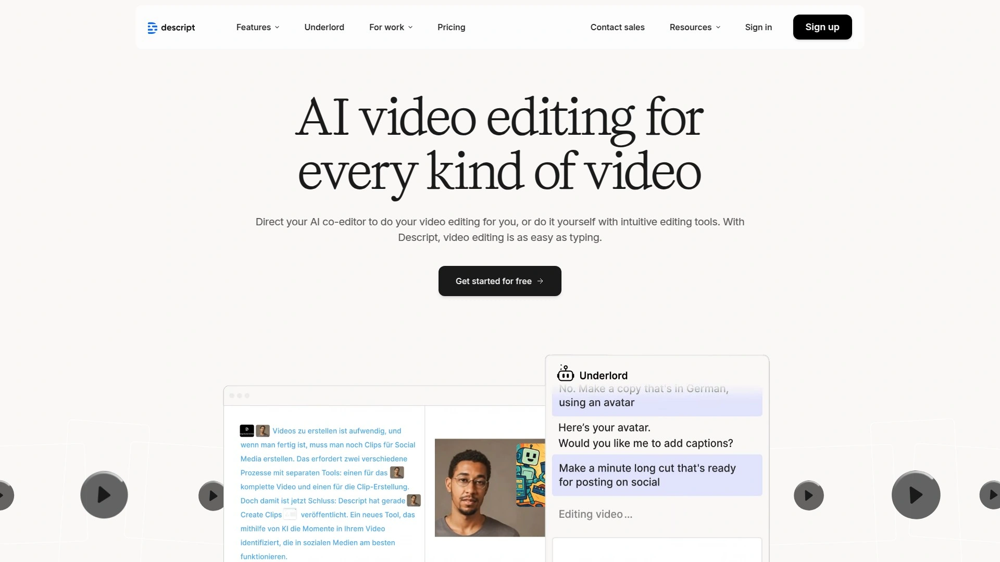

Descript revolutionizes editing by treating video like a text document—delete words in the transcript and the corresponding video segments vanish automatically. The Underlord AI assistant handles complex requests through natural language prompts, from creating TikTok clips to adding chapter markers. Studio Sound removes background noise without expensive microphones, while Eye Contact correction and filler word removal polish raw recordings instantly.

Multitrack editing separates video, audio, and graphics layers for granular control. AI avatars can present content when staying off-camera suits the project better. The Regenerate feature clones voices to fix mistakes without re-recording. Descript suits podcasters, educators, and video teams who value text-based workflows and rapid iteration over traditional timeline editing.

## **[Kapwing](https://www.kapwing.com/ai-video-generator)**

All-in-one studio automating B-roll generation, subtitles, and format optimization.

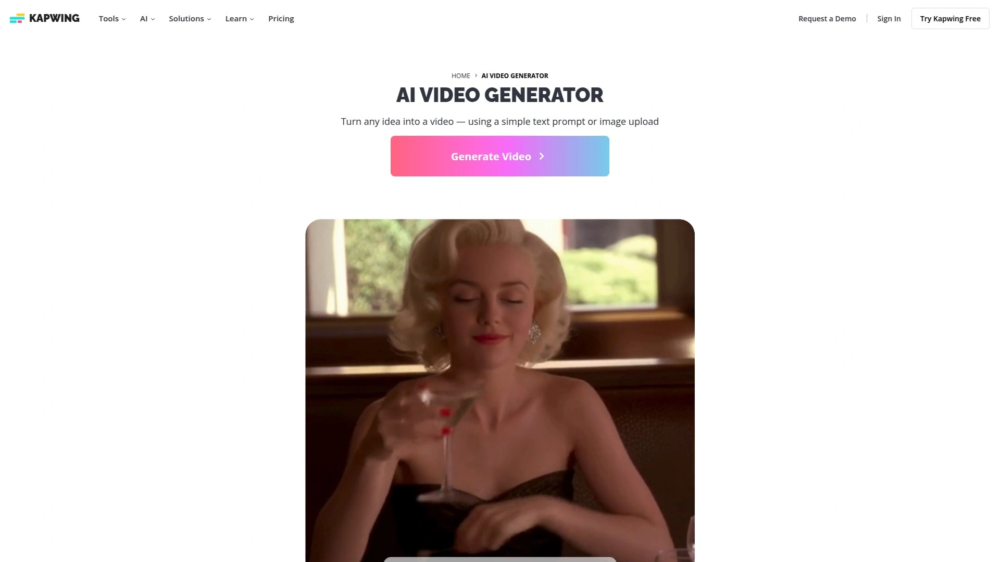

Kapwing generates fully-edited video projects with B-roll, subtitles, voice over, and background music from simple text prompts. The Video Project tab creates complete 5-minute packages automatically, while Video Clips handles shorter 15-second to 1-minute content optimized for TikTok, YouTube, or marketing campaigns. AI-powered tools include transcript-based trimming, background removal, eye contact correction, and lip sync.

The platform automatically sources and packages visual assets based on style preferences, eliminating manual stock library searches. Teams collaborate in real-time with direct feedback on videos, streamlining approval workflows. Kapwing works particularly well for social media managers and content teams producing high volumes across multiple formats and platforms simultaneously.

## **[Luma AI Dream Machine](https://lumalabs.ai/dream-machine)**

Image-to-video powerhouse with character consistency and creative prompting.

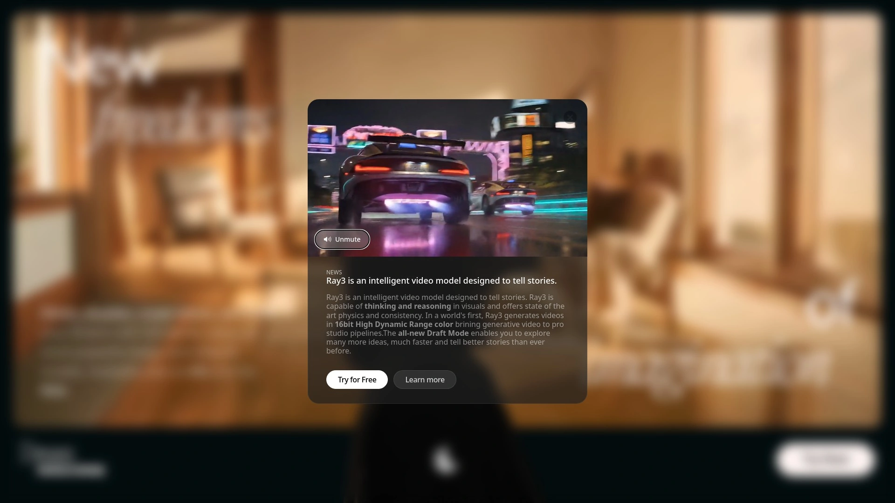

Luma Dream Machine transforms static images into fluid video sequences through AI-powered animation. Users can reference up to four images simultaneously, creating unique combinations while maintaining character consistency across scenes. The Modify feature enables conversational editing—describe desired changes and the system adjusts accordingly without starting over.

The platform supports brainstorming through creative query suggestions and collaborative Boards for sharing processes. Ray3 model delivers 16-bit HDR color for professional studio integration, with Draft Mode enabling rapid exploration of multiple concepts. Dream Machine excels at visual storytelling, children's content animation, and creative projects where imaginative flexibility matters more than corporate polish.

## **[Kling AI](https://klingai.com/global/)**

High-resolution video generator offering both text-to-video and image-to-video creation.

Kling AI generates videos up to 1080P resolution from text prompts or reference images, with extension features supporting creative content up to 3 minutes long. The platform handles text-to-image and image-to-image generation, allowing single-click conversion from static visuals to animated sequences. Community features enable browsing work from other creators for inspiration and collaboration opportunities.

The Kling large model demonstrates strong physics understanding, recreating organic camera movements like handheld shots from classic films. Both text-to-video and image-to-video functions support various dimensions and styles, giving creators flexibility for different platform requirements. Kling particularly appeals to filmmakers and visual storytellers prioritizing motion quality and cinematic feel.

## **[Elai.io](https://elai.io)**

Training video specialist with voice cloning and automated translation capabilities.

Elai.io focuses on learning and development content, offering multilingual voice cloning across 28 languages. The platform converts articles to videos and transforms PowerPoint presentations into narrated video slides automatically. AI Storyboard features help craft course outlines that become engaging videos in just a few clicks.

With 450+ accents across 75+ languages and automated one-click translation, Elai.io simplifies global training rollouts. The template library accelerates production for teams of all sizes, while voice cloning ensures brand consistency when avatars narrate scripts. The platform suits HR departments, educators, and enterprise training programs needing scalable multilingual content without voice actor costs.

## **[Colossyan Creator](https://www.colossyan.com)**

Workplace learning platform converting PDFs and PowerPoints into interactive training videos.

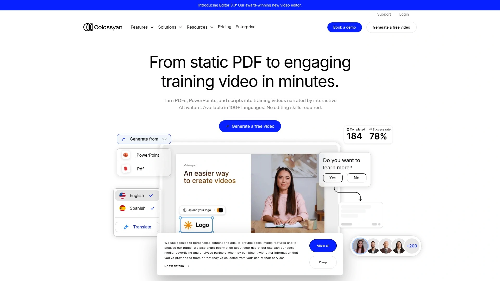

Colossyan Creator transforms static training materials into engaging videos narrated by interactive AI avatars. The platform converts text, PDF files, and PowerPoint presentations into video content featuring 150+ realistic avatars and voice styles. Users can create personal AI avatars from uploaded photos and clone their own voice for brand consistency.

Automated translation supports 70+ languages with region-specific voices, accents, and subtitles for global teams. The interface resembles slide deck editing rather than timeline manipulation, making it accessible to non-video professionals. Interactive elements like quizzes and branching paths transform passive viewing into active learning. Colossyan excels in corporate training, onboarding, and educational scenarios where engagement and localization matter.

## **[DeepBrain AI Studios](https://www.aistudios.com)**

All-in-one platform delivering studio-quality videos with 100+ photorealistic avatars.

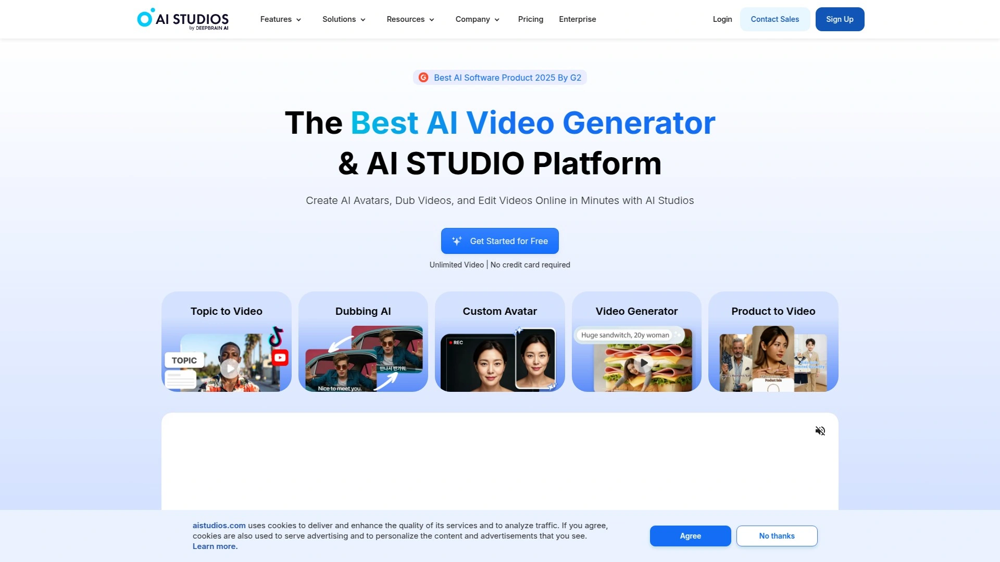

DeepBrain AI Studios generates professional videos in 110+ languages through text-to-video technology with lifelike AI avatars. The platform offers text-to-speech in over 80 languages, one-click translations, and AI script assistance for content refinement. Users can create custom avatars matching specific brand needs while leveraging 100+ pre-built templates for rapid production.

Collaborative workspaces enable team-based editing with synchronized projects, and built-in hosting eliminates third-party dependencies. The platform supports URL or document uploads to jumpstart scripts, then customizes videos with avatars, voices, text, images, and animations. DeepBrain particularly suits businesses and educators needing consistent, multilingual content at scale without filming equipment or studios.

## **[Wave.video](https://wave.video)**

Comprehensive creator platform combining editing, live streaming, and stock footage access.

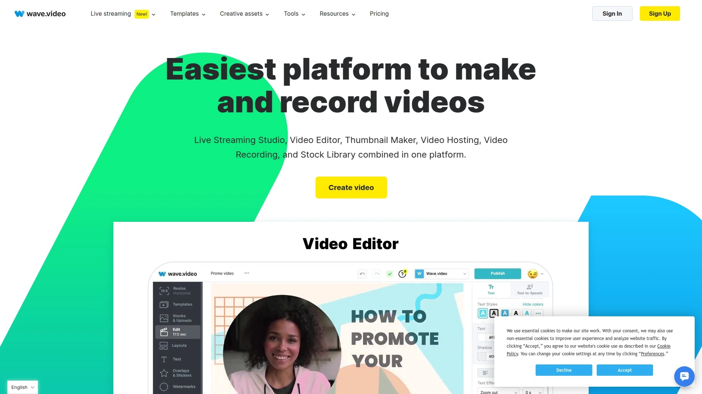

Wave.video provides an integrated environment for creating, editing, and broadcasting video content online. The built-in stock footage library supplies media even when users lack their own footage, while instant resizing adapts videos to 30+ social formats including Instagram Stories and vertical layouts. Animated text effects, stickers, and GIFs enhance engagement.

The platform includes live streaming software with real-time chat, multistreaming to multiple channels simultaneously, and recorded broadcast hosting. Cloud-based operation requires no downloads or installations, making it accessible from any browser. Wave.video serves content creators, business owners, and social media managers needing flexible tools for both pre-recorded and live video without juggling multiple services.

## **[Filmora](https://filmora.wondershare.com)**

Feature-rich editing suite with AI text-to-video, image animation, and audio-to-video tools.

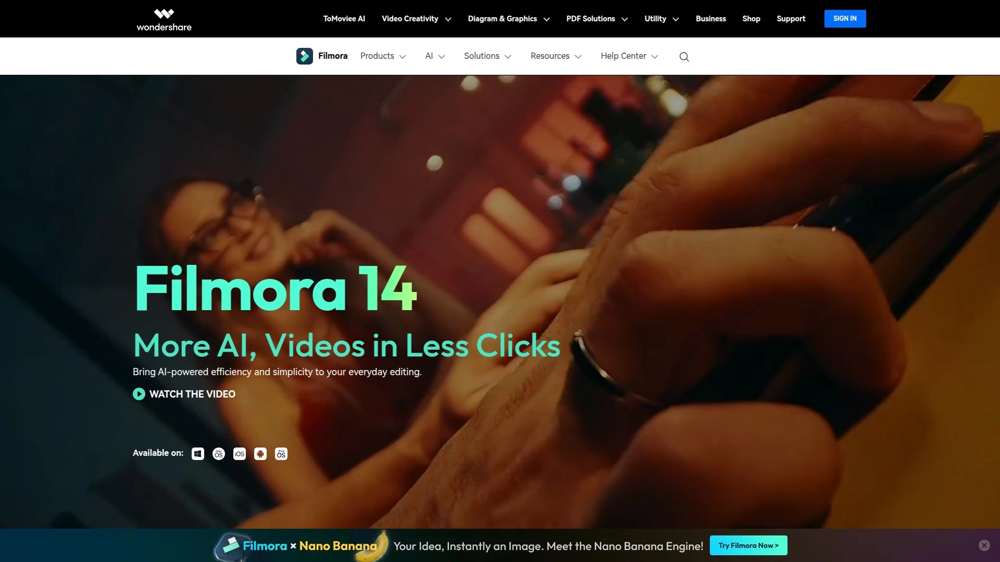

Filmora delivers comprehensive video editing powered by AI across multiple input types—text, images, and audio all transform into publish-worthy videos. The AI text-to-video generator creates scripts, storyboards, and scenes from simple prompts, with editable visuals and dialogue before final generation. Veo 3-powered technology produces high-quality outputs with natural audio.

Image-to-video features apply trending viral effects or animate photos through text prompts, perfect for TikTok and Instagram Reels. Audio-to-video converts podcasts into visual clips by identifying compelling moments and generating matching scenes. Additional AI tools include smart short clip creation, portrait cutout, video enhancement, and multilingual translation. Filmora suits creators wanting desktop-grade editing flexibility combined with AI acceleration.

## How do AI video generators actually save time?

Traditional video production chains involve scriptwriting, filming, editing, voiceover recording, and final polish—each step consuming hours or days. AI generators collapse these stages into minutes by automating media selection, voice synthesis, and scene assembly simultaneously. Many platforms let you edit by simply changing text rather than manipulating timelines, which speeds revisions dramatically.

## Can AI-generated videos match human-produced content quality?

Output quality depends heavily on use case. For talking-head presentations, training modules, and social media clips, AI avatars and automated editing now deliver professional results indistinguishable from traditional production. Creative storytelling, complex cinematography, and emotional performances still benefit from human direction, though tools like Runway and Luma Dream Machine narrow that gap steadily. The practical answer: test your specific requirements, because capabilities improve monthly.

## What makes VideoGen suitable for teams without video experience?

VideoGen removes technical barriers by handling the entire production pipeline automatically—from outlining scripts to sourcing matching visuals to adding finishing touches. The browser-based interface requires zero software installation, and the three-click workflow means team members can create professional videos their first time using the platform. Centralized billing and project sharing simplify collaboration, while 200+ voices across 50+ languages eliminate the need for recording equipment or voice actors.

## Conclusion

The AI video landscape keeps expanding, but these fifteen platforms represent the current frontrunners across different needs—from rapid social content to multilingual training to cinematic storytelling. Most offer free trials, so testing two or three against your actual projects reveals the best fit faster than reading endless comparisons.

**[VideoGen](https://videogen.io)** particularly shines when teams need professional results without video production expertise, handling everything from script outlines to final polish while supporting global audiences through extensive language options. Whether you're creating training modules, marketing content, or social videos, the right AI generator transforms hours of traditional production into minutes of focused work.
